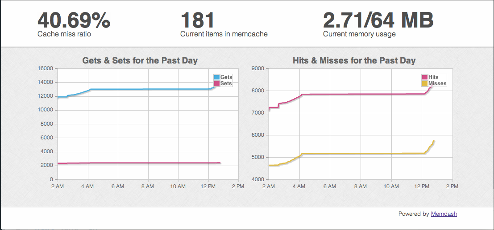

# Memdash  

A dashboard for your memcache. **This is a work in progress,** but aims to provide a little insight into your application's memcached servers.

## Installation

Add this line to your application's Gemfile:

    gem 'memdash'

And then execute:

    $ bundle

Or install it yourself as:

    $ gem install memdash

## Usage

TODO: Write usage instructions here

## Contributing

1. Fork it
2. Create your feature branch (`git checkout -b my-new-feature`)
3. Commit your changes (`git commit -am 'Added some feature'`)
4. Push to the branch (`git push origin my-new-feature`)
5. Create new Pull Request
